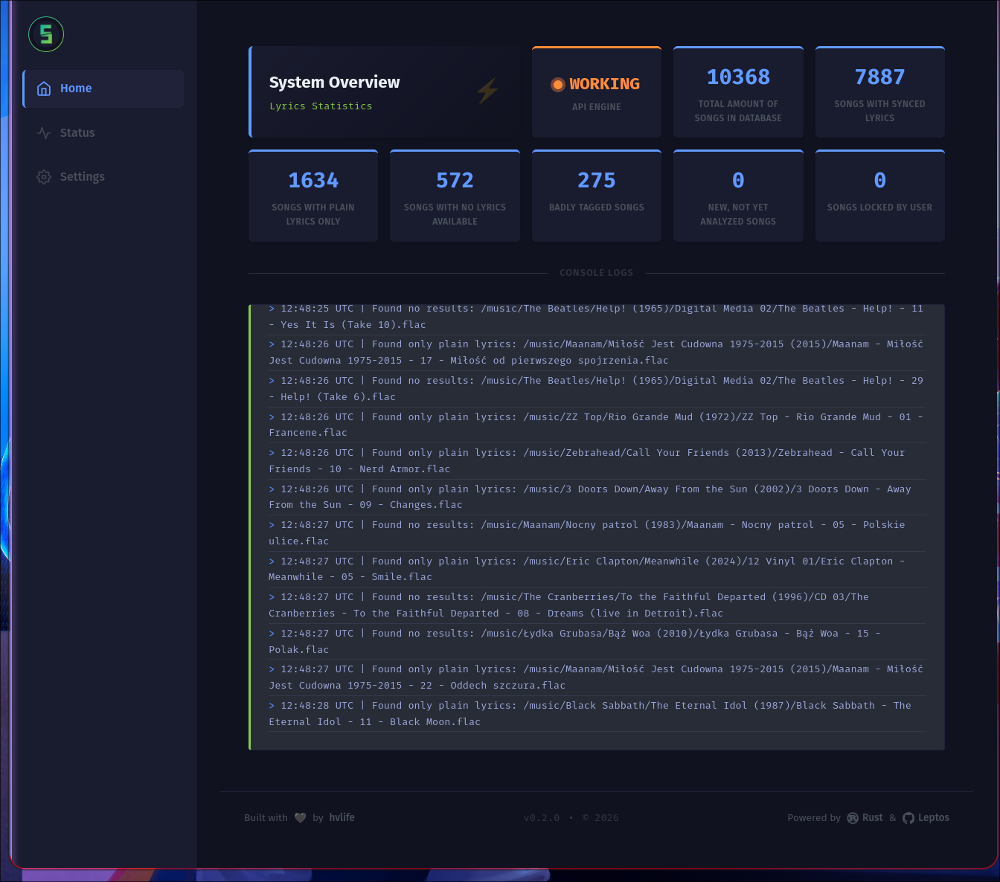
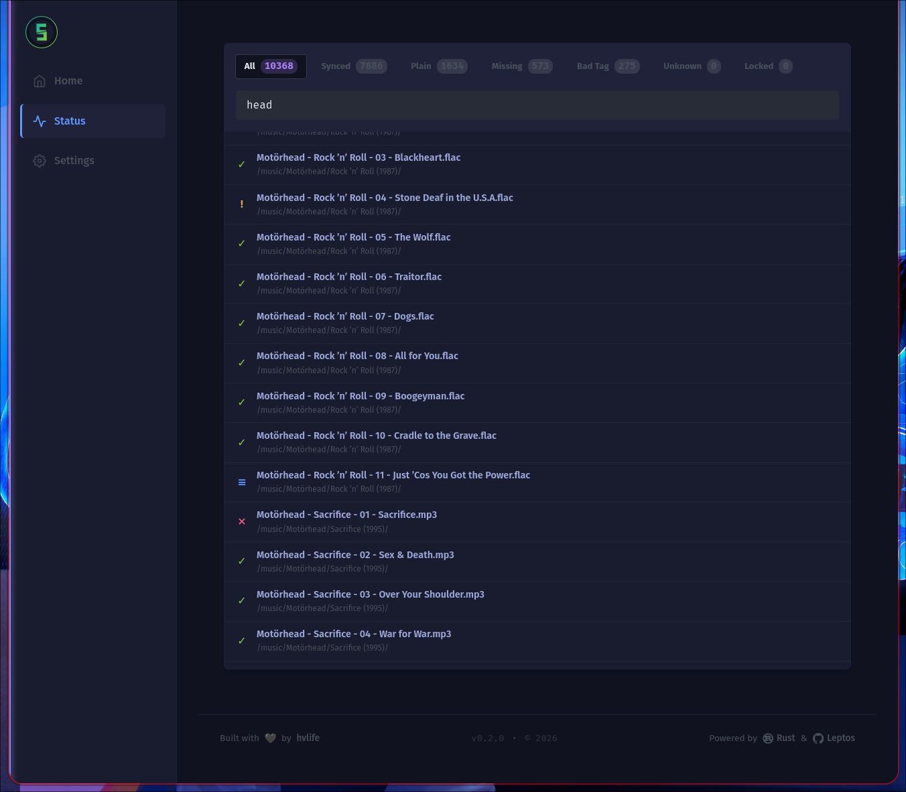
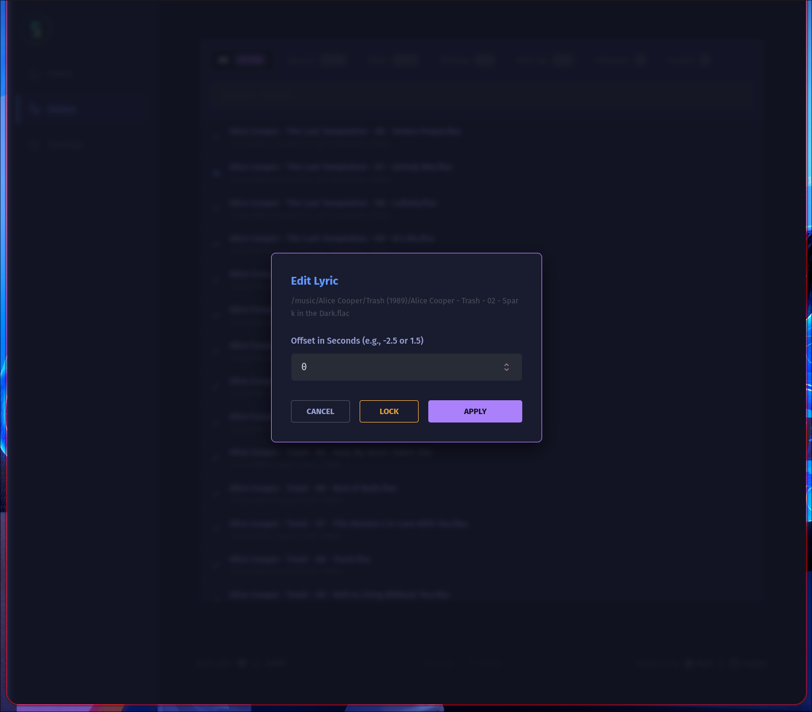
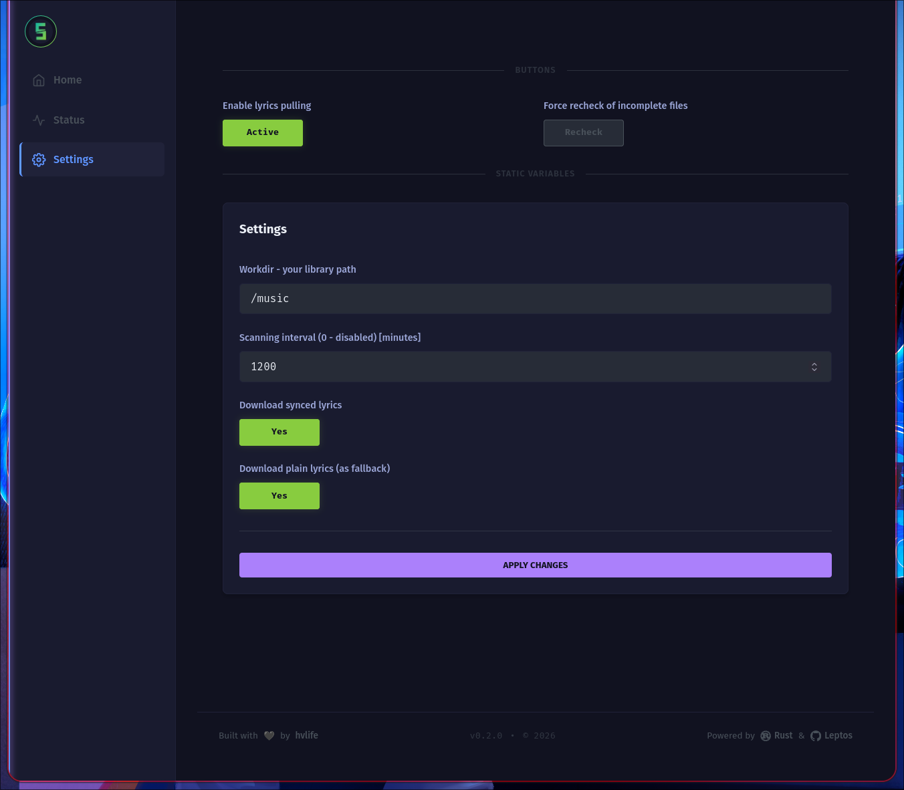
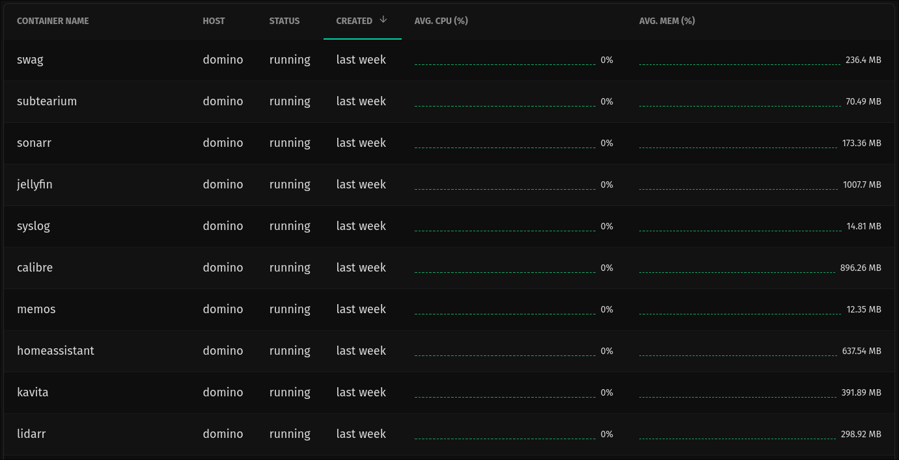

# Subtearium

## An arr* stack element, responsible for downloading, handling, and editing music subtitles

Dev stack is based on Rust + Leptos + Axum. 
As a lyrics source it's using indispensable lrclib.

Main features:
 * Lightweight
 * Support for sync, and plain lyrics (configurable)
 * Clear reporting of each library entry state
 * Easy lyrics locking, to prevent overwrite of unwanted files
 * Quick sync correction, by shifting synced lyrics timestaps +/- seconds
 * New library entries detection
 * Automatic searching for missing or incomplete lyrics on time interval
 * Support for mobile UI

This project is in beta stage, so breaking changes and unstability are to be expected.
All contributions and suggestions are welcome, as well as bug reports.
Before using, please backup your library, this service shouldn't affect files other than .lrc, but I don't wan't to be responsible for you losing your heavily collected data.

## Setup
Docker is a preffered way of running Subtearium, here is example compose snippet:
```docker-compose
  subtearium:
    container_name: subtearium
    image: hvlife/subtearium:latest
    environment:
      - PUID=1000
      - PGID=1000
    ports:
      - 2137:2137/tcp
    volumes:
      - /docker/appdata/subtearium:/app/data:rw
      - /mnt/data/media/music:/music:rw
    restart: unless-stopped

```

Upon starting you can access web UI at `0.0.0.0:2137`.






## RAM usage comparison with over 10k songs


## Development
You can run the project in dev mode with `cargo leptos watch`, just make sure that your wasm-bindgen is correct version.
More insight in the Leptos Axum tutorial.
